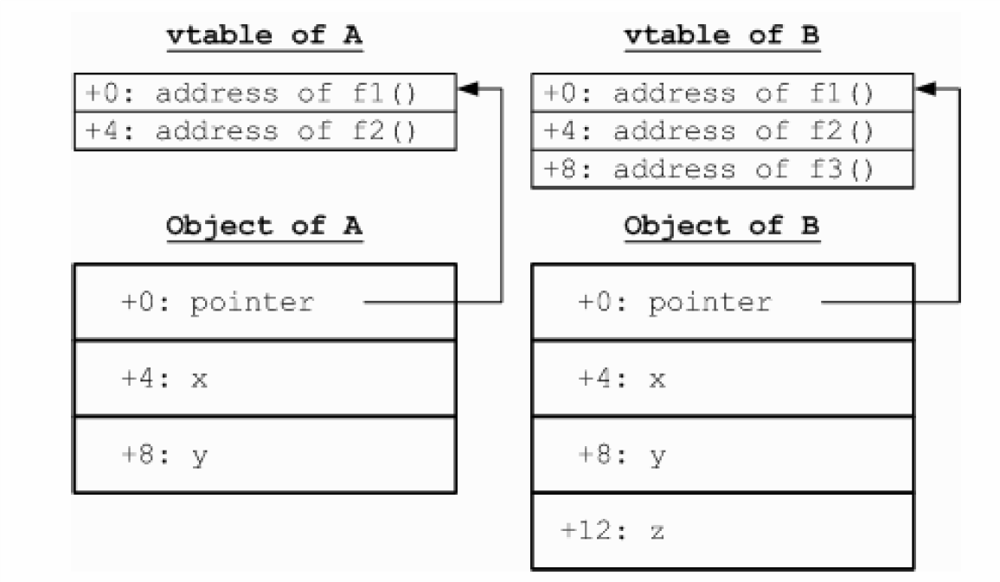

# 面向对象机制

面向对象机制的重要特点是封装、继承和多态三方面，这三方面在Decaf语言中分别体现为：类和对象的机制、类的继承机制、成员函数的动态分发机制。这三种机制除了需要通过语义分析的帮助来实现以外，还需要在运行时存储布局、函数调用等方面来加以实现。其中类和对象的机制和类的继承机制涉及到对象的内存表示方式，成员函数的动态分发机制涉及到成员函数的调用方法，在成员函数中访问成员域涉及到this关键字的实现方法，我们在下面对这三部分内容分别进行简单的介绍（同时请回忆C++中面向对象机制的实现方法）。

#### 对象的内存表示及成员变量的访问方法

我们考虑如下类定义：


```java
class A { 
    int x; 
    int y; 
    int f1() {...} 
    int f2() {...} 
} 
class B extends A { 
    bool z; 
    int f3() {...} 
} 


```

我们知道，f1、f2、f3的地址都是存放在A或者B的虚函数表 中的，现在的问题是x、y、z是怎么存储的。由于不同的对象可以有不同的x、y和z的值，因此这些成员变量不能像成员函数那样存放在虚函数表中。一般来说这些域都存放在跟各对象相关联的内存块中，例如A的对象和B的对象的内存块的可能内容分别如图所示：



从图中可以看出，每一个对象实体都对应着一个记录这个对象状态的内存块，其中包括了这个对象的虚函数表指针和所有用于说明这个对象状态的成员变量。成员变量的排布顺序是：“辈分”越高的成员变量越靠前，例如从父类继承而来的成员变量总是在这个内存区域的前面，而子类特有的成员变量在这个内存区域的最后面，并且父类的成员变量的位置总是跟一个父类对象所对应的内存区域里面的情况一致的，这样做的目的是为了实现子类的对象能兼容于父类的对象（继承机制的一个表现）。

当访问一个对象的某个成员变量的时候，首先是通过这个对象的引用（在Decaf中引用通过指针实现，例如this）找到这块内存区域，然后再根据要访问的成员变量在这片内存区域中的偏移量对该成员变量进行访问的，由此可见，在Decaf中，访问一个对象的成员变量需要一次LOAD操作，而访问成员函数则由于需要通过首先按照访问成员变量的方式访问其虚函数表，然后在虚函数表中再次按照访问成员变量的方式拿到函数的入口指针，从而需要用两次LOAD操作。

#### this关键字的处理

在Decaf语言中，成员函数的函数体内可以使用this关键字来获得对当前对象的引用。此外，在成员函数的函数体中对成员变量或者成员函数的访问实际上都隐含着对this的访问。例如，在writeName的函数体内使用了this关键字，则执行who.writeName()的时候this所引用的对象和变量who所引用的对象是相同的，同样道理，如果执行you.writeName()的话则writeName里面的this将引用you所指的对象。可见，在不同的上下文中，调用writeName的时候this所引用的对象是不同的，也就是说不可能在编译的时候确定下来，那么在一般的C++、Java等语言中是怎么实现这个功能的呢？

这里有一个技巧就是把who或者you作为writeName的一个实际参数在调用writeName的时候传进去，这样我们就可以把对this的引用全部转化为对这个参数的引用。例如，当声明Father.writeName的时候，我们在参数表的开头悄悄地加入一个叫做this的隐含参数：

int writeName(class Father this) {...}

并且在调用writeName时，在传实参的时候把消息接收方表达式（即you或者who）的值传进去，即等价于这样的函数调用：

who.writeName() -> call writeName(who);

这样，我们只要把writeName函数体内所有对this关键字的引用都转化为对this隐含参数的引用即可。这个过程中必须小心注意的是this隐含参数的位置跟调用函数的时候的传参顺序要相对应。

实际上，我们在PA2进行visitVarSel的时候应当已经自动完成了this参数的添加操作，在PA3中我们只需要按照一般函数的调用方法来进行压参、求函数入口地址、调用即可(即this的临时变量为_T0)。

#### 虚函数表及成员方法的调用

虚函数表的目的是实现运行时函数地址绑定，即所谓的动态分发机制，例如以下Decaf代码：

```java
class Father { 
    int writeName() { print(1); ...} 
    int smile() { print(2); ...} 
} 
class Son extends Father { 
    int writeName() { print(3); } 
    int laugh() { print(4); } 
} 


```

这里Father类定义了一个writeName()方法，而其子类Son使用新的writeName()覆盖了这个方法。然后考虑以下的代码片断：

```java
class Father a; 
class Son b; 
class Father c; 
a = new Father(); 
b = new Son(); 
c = b; 
```

明显，执行a.writeName()的结果是输出1，执行b.writeName()的结果是输出3，但是执行c.writeName()的结果会是什么呢？虽然c被声明为Father的对象，但是实际上它是一个Son的对象，因此，按照Decaf语言规范，c.writeName()所调用的应当是Son的writeName()，即输出3（跟C++的虚函数特点是一样的）。

这种行为在二进制层次上是怎么实现的呢？这里我们将采用一种叫做“虚函数表”的结构。我们为每一个类都创建一个存放成员函数入口地址的数组如下：

```java
virtual table of Father: 
+0: address of function writeName (the version prints 1) 
+4: address of function smile 
vitural table of Son: 
+0: address of function writeName(the version prints 3) 
+4: address of function smile 
+8: address of function laugh 
```

上图中每个虚函数表中都列出其对应的类的所有可访问的成员函数地址，成员函数地址前面的+0、+4等等表示这个地址存放在虚表中的位置，例如+4表示存放在离虚表开头4字节的地方。然后我们在a和b所指向的内存区域的开头分别放有指向Father和Son的虚表的指针，在每次通过a或者b调用writeName()的时候，我们都首先通过a或b开头的那个虚表指针找到对应的虚函数表，然后在表中找出偏移地址为+0那一项对应的实际函数地址，调用之即可。

现在我们考虑c <- b的情况。由于Decaf的对象赋值采用引用赋值，因此这个赋值语句的效果仅仅是让c和b指向同一块内存区域。因此，按照上面的过程，当调用c.writeName()的时候，我们首先通过c所指向的内存区域找到对应的虚函数表（此时是Son的虚函数表），然后在这个虚函数表内找到writeName偏移量即+0对应的那一项。我们发现这一项对应的函数地址是打印3的那个writeName()函数的地址，因此c.writeName()的调用结果是输出3。

注意这里为了实现成员方法的继承，Son的虚函数表继承了Father的虚函数表中的smile那一项，并且为了保证子类兼容于父类，同名的函数在子类的虚表中的位置跟父类虚表中的位置是一样的，例如writeName和smile两个函数在Son虚表中处于+0和+4两个位置，这跟在Father的虚表中的情况一致；而原来Father中writeName的入口地址被Son版本的writeName的入口地址取代，以此实现成员函数的覆盖。

关于虚函数表的更多内容请参考：

http://en.wikipedia.org/wiki/Virtual_table

从上面关于虚函数表和成员方法的调用过程的介绍可以看出，Decaf中成员方法调用过程与一般C语言函数的调用过程不同之处仅在于通过虚函数表来查找函数入口地址以及加入了隐含的Decaf参数。

#### 静态方法的调用
静态方法类似C语言的函数，直接得到地址调用，不查询虚表。
