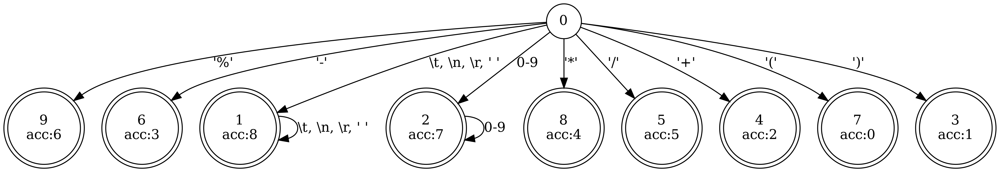
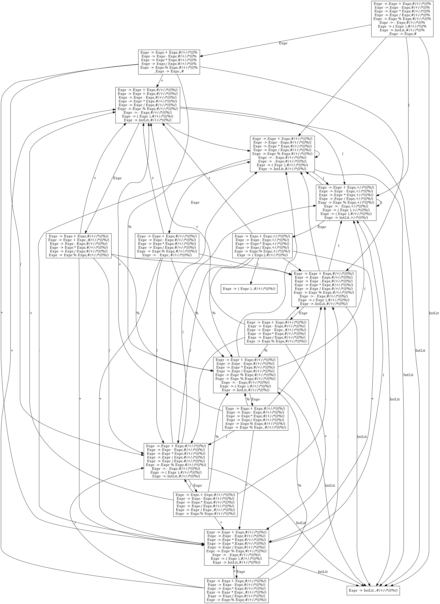
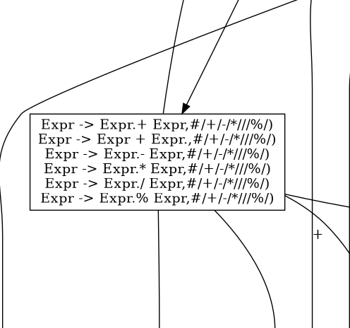

# 一个完整的例子

下面我们简单讲解一下一个解析四则运算表达式的parser，我们会使用除了`#[use_unsafe]`之外的所有选项。

```rust
struct Parser; // 用户希望成为parser的struct

#[lalr1(Expr)]
#[verbose("verbose.txt")]
#[log_token]
#[log_reduce]
#[expand]
#[show_fsm("fsm.dot")]
#[show_dfa("dfa.dot")]
#[lex(r#"
# 描述终结符的优先级和结合性，越靠后优先级越高；结合性分为left，right和no_assoc
priority = [
  { assoc = 'left', terms = ['Add', 'Sub'] },
  { assoc = 'left', terms = ['Mul', 'Div', 'Mod'] },
  { assoc = 'no_assoc', terms = ['UMinus'] },
  { assoc = 'no_assoc', terms = ['RPar'] },
]

# 描述识别出终结符的正则表达式
[lexical]
'\(' = 'LPar'
'\)' = 'RPar'
'\+' = 'Add'
'-' = 'Sub'
'\*' = 'Mul'
'/' = 'Div'
'%' = 'Mod'
'\d+' = 'IntLit'
'\s+' = '_Eps'
"#)]
impl Parser {
  // 为了简单起见，这里都没有实现错误处理
  // 任何一个非终结符的类型必须在整个parser中是统一的，例如这里的Expr是i32类型
  // 任何一个终结符必须具有Token类型
  // 函数的名字其实是可以随便取的，最终的代码中并不会被保留，不过为了可读性还是最好符合本条规则的含义
  #[rule(Expr -> Expr Add Expr)]
  fn expr_add(l: i32, _op: Token, r: i32) -> i32 { l + r }
  #[rule(Expr -> Expr Sub Expr)]
  fn expr_sub(l: i32, _op: Token, r: i32) -> i32 { l - r }
  #[rule(Expr -> Expr Mul Expr)]
  fn expr_mul(l: i32, _op: Token, r: i32) -> i32 { l * r }
  #[rule(Expr -> Expr Div Expr)]
  fn expr_div(l: i32, _op: Token, r: i32) -> i32 { l / r }
  #[rule(Expr -> Expr Mod Expr)]
  fn expr_mod(l: i32, _op: Token, r: i32) -> i32 { l % r }
  #[rule(Expr -> Sub Expr)]
  #[prec(UMinus)] // 本条产生式与UMinus相同，比二元运算符都高
  fn expr_neg(_op: Token, r: i32) -> i32 { -r }
  #[rule(Expr -> LPar Expr RPar)]
  fn expr_paren(_l: Token, i: i32, _r: Token) -> i32 { i }
  #[rule(Expr -> IntLit)]
  fn expr_int(i: Token) -> i32 { std::str::from_utf8(i.piece).unwrap().parse().unwrap() }
}
```

利用`#[expand]`，得到过程宏输出的代码如下(为了美观，代码经过了格式化)：

```rust
// 两个宏用来集中管理safe和unsafe模式下的下标访问和不可达
// 如果使用了use_unsafe的话，它们分别会调用get_unchecked和unreachable_unchecked
macro_rules! index { ($arr: expr, $idx: expr) => { $arr[$idx as usize] }; }
macro_rules! impossible { () => { unreachable!() }; }

// 非终结符的编号
// 终结符和非终结符都有编号，并且保证终结符的编号都小于非终结符的编号
#[derive(Clone, Copy, Debug, Eq, PartialEq)]
pub enum TokenKind { _Eps = 2, _Eof, _Err, Add, Sub, Mul, Div, Mod, UMinus, RPar, LPar, IntLit }

// lr分析的value stack的元素，这个例子里只能是lexer解析出来的token或者表示Expr的i32
pub enum StackItem<'p> { _Token(Token<'p>), _0(i32) }

// lexer解析出来的token的类型，包含了终结符种类，对应的字符串片段，行列号信息
#[derive(Clone, Copy, Debug, Eq, PartialEq)]
pub struct Token<'l> {
  pub ty: TokenKind,
  pub piece: &'l [u8],
  pub line: u32,
  pub col: u32,
}

pub struct Lexer<'l> {
  pub string: &'l [u8],
  pub line: u32,
  pub col: u32,
}

impl<'l> Lexer<'l> {
  pub fn new(string: &[u8]) -> Lexer {
    Lexer { string, line: 1, col: 1 }
  }

  // 新解析一个Token
  // 如果解析结果是_Eps就不会返回给parser，如果是_Eof可能会导致parser完成最终的Acc或者出错
  // 如果是_Err会导致parser出错
  pub fn next(&mut self) -> Token<'l> {
    // ACC表示每个dfa节点对应于哪个终结符，如果一个都不对应就是_Err
    static ACC: [TokenKind; 10] = [一张巨大的表，这里不列了];
    // EC表示equivalent char，有些字符对dfa处理起来可能是一样的，用EC先减小字符集的大小，从而减小dfa转移表的大小
    static EC: [u8; 256] = [一张巨大的表，这里不列了];
    // DFA_EDGE表示dfa的状态转移表，逻辑上DFA_EDGE[state][char]表示在state处遇到char时的下一个state编号
    // 规定编号0必须代表出错状态
    // 下面的所有u8(不包括上面那个EC的u8)，都是可以变化的，是可以容纳状态数的最小无符号整数
    static DFA_EDGE: [[u8; 10]; 10] = [一张巨大的表，这里不列了];
    // 这个循环不断把字符喂给dfa，直到：
    // 识别出一个非_Eps的token后出错或文件结尾 => 返回这个token
    // 没有识别出非_Eps的token时出错 => 返回_Err
    // 没有识别出非_Eps的token时文件结尾 => 返回_Eof
    loop {
      let (mut line, mut col) = (self.line, self.col);
      let mut last_acc = TokenKind::_Err;
      let mut state = 0;
      let mut i = 0;
      while i < self.string.len() {
        let ch = index!(self.string, i);
        let ec = index!(EC, ch);
        let nxt = index!(index!(DFA_EDGE, state), ec);
        let acc = index!(ACC, nxt);
        if acc != TokenKind::_Err { last_acc = acc };
        state = nxt;
        if nxt == 0 { // 出错，不能消耗掉当前字符，它属于下一个token
          let piece = &self.string[..i];
          self.string = &self.string[i..];
          if last_acc != TokenKind::_Eps {
            return Token { ty: last_acc, piece, line, col };
          } else {
            line = self.line;
            col = self.col;
            last_acc = TokenKind::_Err;
            state = 0;
            i = 0;
          }
        } else {
          // 维护行号列号
          // 有些字符其实宽度不一定是1(如tab)，但是简单起见这里统一用1表示了
          if ch == b'\n' {
            self.line += 1;
            self.col = 1;
          } else {
            self.col += 1;
          }
          i += 1;
        }
      }
      // 文件结尾
      let piece = &self.string[..i];
      self.string = b"";
      return if last_acc != TokenKind::_Eps && i != 0 {
        Token { ty: last_acc, piece, line, col }
      } else {
        Token { ty: TokenKind::_Eof, piece: b"", line: self.line, col: self.col }
      };
    }
  }
}

// lr分析中对于一个lookahead字符的几种动作
#[derive(Copy, Clone, Debug, Eq, PartialEq)]
pub enum Act { Shift(u8), Reduce(u8), Acc, Err }

impl<'p> Parser {
  pub fn parse<'l: 'p>(&mut self, lexer: &mut Lexer<'l>) -> Result<i32, Token<'l>> {
    // PROD表示产生式的(左端项编号，右端项数目)
    static PROD: [(u8, u8); 9] = [一张巨大的表，这里不列了];
    // lr分析的动作表
    static ACTION: [[Act; 12]; 18] = [一张巨大的表，这里不列了];
    // lr分析的goto表
    static GOTO: [[Option<u8>; 2]; 18] = [一张巨大的表，这里不列了];
    let mut value_stk: Vec<StackItem<'p>> = vec![];
    let mut state_stk: Vec<u8> = vec![0];
    let mut state = 0; // state永远与栈顶相等，只是为了减少一些访存
    let mut token = lexer.next(); // lookahead符号
    println!("{:?}", token); // log_token的作用，输出一个刚解析出的token
    // 标准的lr分析循环
    loop {
      let act = index!(index!(ACTION, state), token.ty as u32 - 2); // - 2是因为非终结符的编号都>= 2
      match act {
        Act::Shift(s) => {
          // 移进，把token压入value stack，把shift的目标状态压入state stack
          value_stk.push(StackItem::_Token(token));
          state_stk.push(s);
          state = s;
          // 获取新的lookahead符号
          token = lexer.next();
          println!("{:?}", token); // 还是log_token的作用，输出一个刚解析出的token
        }
        Act::Reduce(r) => {
          // 规约，先从state stack上弹出产生式右端项那么多个的state
          let prod = index!(PROD, r);
          for _ in 0..prod.1 { match state_stk.pop() { Some(_) => {} None => impossible!() }; }
          // 然后从value stack上弹出产生式右端项那么多个的value用于执行语法动作
          let value = match r {
            0 => {
              println!("Expr -> Expr Add Expr"); // log_reduce的作用，输出产生式
              let r = match value_stk.pop() { Some(StackItem::_0(x)) => x, _ => impossible!() };
              let _op = match value_stk.pop() { Some(StackItem::_Token(x)) => x, _ => impossible!() };
              let l = match value_stk.pop() { Some(StackItem::_0(x)) => x, _ => impossible!() };
              // 这个 l + r 就是用户编写的语法动作，嵌到这里来了
              StackItem::_0({ { l + r } })
            }
            // 这里省略类似的Sub Mul Div Mod...
            // 最后的一次规约，把用户定义的目标非终结符规约到增广语法中新定义的非终结符
            8 => {
              println!("_Expr -> Expr");
              let _1 = match value_stk.pop() { Some(StackItem::_0(x)) => x, _ => impossible!() };
              StackItem::_0({ _1 })
            }

            _ => impossible!(),
          };
          // 然后在value stack上压入新生成的value，并且通过访问goto表得知state stack上需要压入的新state
          value_stk.push(value);
          let cur = index!(state_stk, state_stk.len() - 1);
          let nxt = match index!(index!(GOTO, cur), prod.0) { Some(nxt) => nxt, None => impossible!() };
          state_stk.push(nxt);
          state = nxt;
        }
        Act::Acc => {
          // 接受，将栈顶作为最终结果返回
          match state_stk.pop() { None => impossible!(), Some(_) => {} };
          let res = match value_stk.pop() { Some(StackItem::_0(r)) => r, _ => impossible!() };
          return Ok(res);
        }
        // 出错，返回导致出错的token
        Act::Err => return Err(token),
      }
    }
  }
}
```

来跑一个实际的例子：

```rust
assert_eq!(Parser.parse(&mut Lexer::new(b"1 - 2 * (3 + 4 * 5 / 6) + -7 * -9 % 10")), Ok(-8));
```

结果显然是正确的，可以看一下`#[log_token]`和`#[log_reduce]`的输出：

```
Token { ty: IntLit, piece: [49], line: 1, col: 1 }
Token { ty: Sub, piece: [45], line: 1, col: 3 }
Expr -> IntLit
Token { ty: IntLit, piece: [50], line: 1, col: 5 }
Token { ty: Mul, piece: [42], line: 1, col: 7 }
Expr -> IntLit
Token { ty: LPar, piece: [40], line: 1, col: 9 }
Token { ty: IntLit, piece: [51], line: 1, col: 10 }
Token { ty: Add, piece: [43], line: 1, col: 12 }
Expr -> IntLit
Token { ty: IntLit, piece: [52], line: 1, col: 14 }
Token { ty: Mul, piece: [42], line: 1, col: 16 }
Expr -> IntLit
Token { ty: IntLit, piece: [53], line: 1, col: 18 }
Token { ty: Div, piece: [47], line: 1, col: 20 }
Expr -> IntLit
Expr -> Expr Mul Expr
Token { ty: IntLit, piece: [54], line: 1, col: 22 }
Token { ty: RPar, piece: [41], line: 1, col: 23 }
Expr -> IntLit
Expr -> Expr Div Expr
Expr -> Expr Add Expr
Token { ty: Add, piece: [43], line: 1, col: 25 }
Expr -> LPar Expr RPar
Expr -> Expr Mul Expr
Expr -> Expr Sub Expr
Token { ty: Sub, piece: [45], line: 1, col: 27 }
Token { ty: IntLit, piece: [55], line: 1, col: 28 }
Token { ty: Mul, piece: [42], line: 1, col: 30 }
Expr -> IntLit
Expr -> Sub Expr
Token { ty: Sub, piece: [45], line: 1, col: 32 }
Token { ty: IntLit, piece: [57], line: 1, col: 33 }
Token { ty: Mod, piece: [37], line: 1, col: 35 }
Expr -> IntLit
Expr -> Sub Expr
Expr -> Expr Mul Expr
Token { ty: IntLit, piece: [49, 48], line: 1, col: 37 }
Token { ty: Add, piece: [43], line: 1, col: 40 }
Expr -> IntLit
Expr -> Expr Mod Expr
Expr -> Expr Add Expr
Token { ty: IntLit, piece: [49], line: 1, col: 42 }
Token { ty: _Eof, piece: [], line: 1, col: 43 }
Expr -> IntLit
Expr -> Expr Add Expr
```

比较枯燥，其实也没啥看的必要，只有出错的时候用于调试可能才有意义。

最后看一下那几个文件中都输出了什么内容。先看最简单的dfa的图形，大概是这样的：



再看一个巨大的lr fsm(美观起见，我把`Add`等终结符换成了对应的符号，`_Eof`替换成了`#`)：



值得注意的是这个lr fsm是没有经过解决冲突的处理的，例如图中的这一处：



显然是有移进-规约冲突的。

但是文本表示的verbose信息中体现了冲突的解决，这个片段对应于`verbose.txt`中的：

```
State 12:
  Expr -> Expr.Add Expr
  Expr -> Expr Add Expr.
  Expr -> Expr.Sub Expr
  Expr -> Expr.Mul Expr
  Expr -> Expr.Div Expr
  Expr -> Expr.Mod Expr

  Div => Shift(8) (✓) # 遇到/时移进，因为/优先级比+高
  Div => Reduce(0) (-)
  Add => Shift(5) (-)
  Add => Reduce(0) (✓) # 遇到+时规约，因为+左结合
  RPar => Reduce(0) (✓)
  Mul => Shift(7) (✓) # 遇到*时移进，因为*优先级比+高
  Mul => Reduce(0) (-)
  Mod => Shift(9) (✓) # 遇到%时移进，因为%优先级比+高
  Mod => Reduce(0) (-)
  Sub => Shift(6) (-)
  Sub => Reduce(0) (✓) # 遇到-时规约，因为+和-优先级一样高，而+左结合
  _Eof => Reduce(0) (✓)
```

可见这里所有冲突选择都被优先级和结合性的约束给消除了。