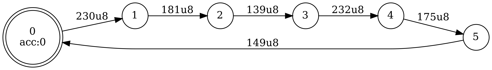

# 编写lexer

## 编写lexer

`#[lex(TomlOfLexer)]`的[toml](https://github.com/LongTengDao/TOML/blob/%E9%BE%99%E8%85%BE%E9%81%93-%E8%AF%91/versions/cn/toml-v0.5.0.md)中应该包含`priority`和`lexical`两个字段，前者用于指定终结符的优先级和结合性，**排在后面的优先级高**；后者用于指定终结符的正则表达式，当一个字符串片段可以被解释成两种终结符时(例如`int`可以被解释成`Int`或者`Identifier`)，选择的原则是尽量选长的匹配，如果两个匹配一样长，**排在前面的优先级高**。

一个比较简单的`#[lex(TomlOfLexer)]`的例子如下：

```rust
#[lex(r##"
priority = [
  { assoc = 'left', terms = ['Add', 'Sub'] },
  { assoc = 'left', terms = ['Mul', 'Div', 'Mod'] },
]

[lexical]
'void' = 'Void'
'int' = 'Int'
...
'\+' = 'Add'
'-' = 'Sub'
'\*' = 'Mul'
'/' = 'Div'
'%' = 'Mod'
'//[^\n]*' = '_Eps'
'\s+' = '_Eps'
'\d+|(0x[0-9a-fA-F]+)' = 'IntConst'
'[A-Za-z][_0-9A-Za-z]*' = 'Identifier'
'.' = '_Err'
"##)]
```

这其中`Add`，`Sub`这些就是终结符的名字，在后面描述产生式的时候会用到，产生式中不支持直接用终结符的字符串形式来表示终结符，例如yacc/bison中可以写`Expr: Expr '+' Expr`，lalr1中是不行的，只能写成`Add`。`_Eps`是一个内建的终结符，表示解析出这个结果时，lexer不应该告诉parser找到了一个终结符，而是忽略它继续解析下去，它在这里表示空字符或者注释。`_Err`也是一个内建的终结符，表示无法识别的结果，这里在识别到任意字符，且不能解读为之前的任何一个模式的时候返回它。

此外还有一个内建的终结符`_Eof`，会在字符串结束时被返回给parser，用户一般不应该主动返回`_Eof`。

re2dfa支持一个正则表达式的子集，这里列举几个不符合正则标准的地方

1. 不支持`{n}`，`{m,n}`，`^`，`$`，但是`{`，`}`，`^`，`$`仍然需要用`\`来转义，直接用会报错
2. `()`没有分组作用(当然，因为这里根本没有分组这个概念)
3. 只支持贪婪匹配
4. 虽然支持`\s`，`\d`，`\w`，但不支持`\S`，`\D`，`\W`
5. `.`就是识别所有字符，而不是识别所有非`\n`的字符

其余功能的支持也不一定完整，如果遇到了什么不符合直觉的结果可以把lexer单独拿出来调试一下，如果的确是re2dfa没有支持的话，就暂且换一个更简单的方法来实现吧，毕竟理论上正则只需要拼接，`|`和`*`就可以实现所有功能了。

有一些正则表达式虽然合法，也完全可以构造出正常的自动机，但是这些自动机可能不适合用于lexer。这样的自动机有两种，一种是不接受任何字符串，一种是接受空串。之所以说它们不适合用于lexer，是因为在遇到一些corner case的时候比较难以精确定义它们的行为，例如：
- 如果输入空字符串，不接受任何字符串的自动机应该返回`_Eof`还是`_Err`?
- 在字符串尾的时候，接受空串的自动机应该返回`_Eof`还是对应的token?

出于这样的原因，lalr1(而不是re2dfa，因为从自动机的角度来说它们是完全合法的)禁止用户编写的正则表达式最终形成这两种自动机。

## 字符集

上面一直在提"字符"的概念，这其实是一个非常模糊的表述，这里有必要说明清楚。

re2dfa是**完全基于字节**的，也就是说从输入的正则表达式，到内部的处理过程，到最终生成的自动机，都假定了处理的字符集一定是在`0, 1, ..., 255`这个范围内的。最终生成的自动机对各种编码(包括ascii码)完全没有感知，只是逐字节读入数据并执行状态转移。

不过这并不意味着re2dfa只能识别单字节字符组成的字符串，因为即使输入的正则表达式中包含了需要多个匹配字节才能识别的字符，这对自动机来说无非就是多执行几次状态转移而已，并没有什么困难的。例如一个utf8编码的正则`测试*`(连接的优先级大于`*`)的自动机如下：



这其中的`230 181 139 232 175 149`就对应于`测试`的每个字节。

在现在这样的实现下，可以很容易精确地描述出正则中的一些元字符的具体含义：

- `.`：`0, 1, ..., 255`内的所有字符
- `\s`：等价于`[\n\t\r ]`
- `\d`：等价于`[0-9]`
- `\w`：等价于`[0-9a-zA-Z_]`

虽然这看起来没什么特别的，但是在对字符编码有感知的正则实现中并不完全是这样的，例如rust的正则库[regex](https://docs.rs/regex/1.1.9/regex/)的规范中规定：

> `\w`, `\d` and `\s` are Unicode aware. For example, `\s` will match all forms of whitespace categorized by Unicode.

re2dfa基于字节的实现更加简单，因此没有这样的能力。

~~虽然说了这么多，但是我相信大家在完成pa的时候应该是不会遇到字符编码相关的问题的。~~
