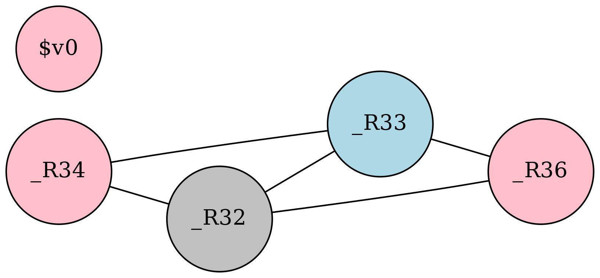

# 图着色寄存器分配原理

为了将实际寄存器分配给虚拟寄存器，需要得知哪两个虚拟寄存器不能使用同一个实际寄存器。由虚拟寄存器构成图的节点，"不能使用同一个实际寄存器"的关系构成了图的边(无向图)，于是寄存器分配就转化成了在这张图上使用平台提供的寄存器数$$K$$来进行$$K$$着色(假定图着色的定义大家都已经理解了)。

两个虚拟寄存器不能使用同一个实际寄存器的条件是存在一条语句，如果一个虚拟寄存器被定值，而另一个虚拟寄存器活跃。

下面以这个函数为例讲解：

```c
static int gcd(int a, int b) {
  while (a != 0) {
    int c;
    c = b % a;
    b = a;
    a = c;
  }
  return b;
}
```

经过指令选择我们会得到(有一定修改，且省略了prologue和epilogue的部分，后面会讲解这两个部分)：

```mipsasm
...
1： _L1:
2： sne _R34,_R32,$zero
3： beqz _R34,_L3
4： rem _R36,_R33,_R32
5： move _R33,_R32
6： move _R32,_R36
7： j L1
8： L3:
9： move $v0,_R33
...
```

注：

1. 以_R开头的都是虚拟寄存器，它们的计数从32开始，这样就可以用数值范围来区分虚拟寄存器和机器寄存器了(也许这在rust里算一个anti-pattern，但是至少在这里我觉得还是比较方便的)。
2. 这里有机器寄存器\$zero和\$v0出现，\$zero是指令选择中的一个小优化，可以不用管它;\$v0在mips调用约定中用来存放返回值，这在"预着色节点"会详细说明
3. 第2，3行看起来有点多余，这是因为指令选择中的优化还是做的太少了，这种冗余可以用窥孔优化来消除，只是我们并没有实现窥孔优化

从tac的流图，生成带有虚拟寄存器的汇编代码后，流图信息得到保留，无需再次划分基本块，但是活跃变量分析需要以汇编代码为对象进行，这与之前以tac为对象进行的活跃变量分析是类似的，下面直接给出最终结果，注释里的是本条语句的$$LiveUse$$集合：

```mipsasm
...
# BB 1
2： sne _R34,_R32,$zero # [_R32 _R33 _R34]
3： beqz _R34,_L3 # [_R32 _R33]

# BB 2
4： rem _R36,_R33,_R32 # [_R32 _R36]
5： move _R33,_R32 # [_R33 _R36]
6： move _R32,_R36 # [_R32 _R33]
7： j L1 # [_R32 _R33]

# BB 3
9： move $v0,_R33 # [$v0]
...
```

注：其实\$zero也会被划到$$LiveUse$$集合，但它与寄存器分配无关，就不考虑了;\$v0虽然作为传递函数返回值使用，但是也可以作为通用寄存器参与一般的计算，最后\$v0 活跃的原因是特殊处理了的函数的返回，在返回语句处将容纳返回值的\$v0标记为活跃。

构建干涉图，一个合法的图着色如下：



粉色对应\$v0，灰色对应\$a0，蓝色对应\$a1，这样即得到了分配完成的程序：

```mipsasm
...
_L1:
sne $v0,$a0,$zero
beqz $v0,_L3
_L2:
rem $v0,$a1,$a0
move $a1,$a0
move $a0,$v0
j _L1
_L3:
move $v0,$a1
...
```

显然粉色对应于\$v0是强制的，不过灰色和蓝色对应的寄存器也不是任意选择的，而是利用了后面提到的干涉图节点合并的技术，将函数传参用的\$a0和\$a1与虚拟寄存器进行了节点合并。
