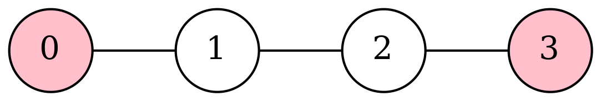

## 干涉图节点合并

如果两个节点在干涉图中没有连边，当然它们就可以被着成同一个颜色，但是也有可能不被着成同一个颜色。如果它们曾经出现在同一条`move`指令中，那么我们**希望**它们被着成同一个颜色，因为如果这样，就可以省去这条`move`指令。着成同一个颜色后，与二者中任意一个有边的节点都不能再使用这个颜色了，从图的角度来看相当于这两个节点被合并为了同一个，它的边集是原来两个边集的并集，这就是干涉图中的节点合并。

这样的合并是否能无限制的进行，即只要两个节点不冲突且曾经出现在同一条`move`指令中，就把它们合并呢?答案是否定的，因为这样做可能导致原本可以$$K$$着色的图变为不能，一个例子如下：

显然原本这张图可以2着色，而如果把没有连边的0，3着成同一个颜色，则这张图只能3着色。如果这个平台只有两个通用寄存器，则不得不导致其中某个节点被spill到栈上，这样是以增加访存次数为代价减少了`move`指令，在现在的体系结构下这显然是不合算的。

因此我们需要一个评价标准来判断合并两个节点是否会让图"更难"$$K$$着色，更确切的说，需要判断是否会让我们的图着色算法更难找到一个$$K$$着色方案(因为即使它仍然可$$K$$着色，但着色算法无法找到了，也可能导致spill)。

Briggs提出了一个启发性的判据：如果合并后的节点的　度数$$\ge K$$的邻居的个数　$$< K$$，那么合并是安全的。证明如下：着色算法会移除合并后的节点的度数$$< K$$的邻居，于是合并后节点的度数将$$< K$$，于是它可以被移除，此时合并对图的影响就消失了，故$$K$$着色方案不会更难被着色算法发现。

因为没有构造预着色节点的边列表，对于预着色节点和普通节点间的合并需要另外的判据(显然，不需要考虑预着色节点和预着色节点的合并)。George提出了一个启发性的判据：对于一个预着色节点R和一个普通节点X，如果对于X的每个邻居T，都满足：

1. T已经和R冲突，或者
2. T的度数$$< K$$

则合并是安全的。对于1，T只会少一个邻居X，而不会增加任何邻居；对于2，T失去邻居X而获得邻居R后，度数仍然$$< K$$。

对于1，实现的时候还需要额外考虑：因为我们没有连预着色节点与预着色节点间的边，所以T和R冲突可能是边集中发现了T-R的边，也可能是T是预着色节点。

至此，图着色的框架可以大致总结如下：

循环检测以下条件：

1. 如果有度数$$< K$$且不可合并的节点，移除一个
2. 否则，如果有可以被安全合并的节点，合并一对
3. 否则，如果有度数$$< K$$，可以合并，但不能安全合并的节点，选择一个，把它标记为不可合并，把因它不可合并而导致不可合并的节点也标记为不可合并
4. 否则，如果还存在度数$$\ge K$$的待着色节点，选择一个强行移除
5. 否则，已经完成了着色的准备工作，退出循环

退出循环后，按照移除节点的顺序逆序把节点添加回到图中，在有可用颜色的时候随机选择，否则把它标记为溢出节点。

着色结束后，如果溢出节点，就需要把代码中对它的读写改写成访存操作，之后重启整个分配过程，如此循环直到一个溢出节点都没有。