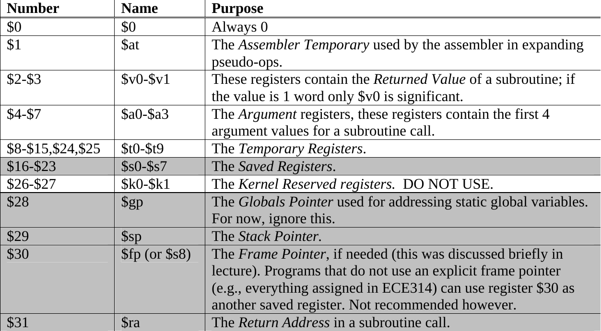

## 调用约定

比较详细的调用约定参见[4]。与寄存器相关的调用约定如下：



其中灰色的寄存器为被调用者保存的寄存器，白色的为调用者保存的寄存器。值得注意的是，虽然\$ra由被调用者保存，它的值也的确在进入和离开被调用的函数时保持一致，但是函数调用指令本身会修改它。

我们把寄存器分配的范围限制在mips的32个通用寄存器中的26个：除了寄存器\$zero，\$k0/1，\$gp，\$at，\$sp外其他寄存器都参与分配。参与分配的寄存器中，\$ra，\$v0等寄存器可能有自己特殊的用途，但是仍然有可能像其他寄存器一样参与一般的分配。

对于被调用者保存的寄存器，首先在指令选择阶段非常暴力地在函数的prologue部分生成代码保存所有寄存器，在epilogue部分生成代码恢复所有寄存器(只需要保存和恢复实际参与分配的那些)：

```mipsasm
foo:
  ...
  move _Rxx0, $s0
  move _Rxx1, $s1
  ...
  move _Rxx7, $s7
  move _Rxx8, $ra
  
  ... # 函数体，所有的返回都翻译为到epilogue的跳转

  move $s0, _Rxx0
  move $s1, _Rxx1
  ...
  move $s7, _Rxx7
  move $ra, _Rxx8
  ...
  jr $ra # 返回
```

其中_Rxx0-8就是普通的虚拟寄存器。对于一个正常大小的函数，寄存器的第一次分配不太可能成功，那么首选的spill的节点很有可能就是这些，因为它们和函数中间的所有定值节点都冲突了。然而如果函数很小(准确来说是函数的寄存器压力很小)，则这些move很可能被成功合并，所以虽然生成了这么多移动指令，最终可能并没有产生任何运行开销。

除了添加这些额外的移动之另外，还需要特殊处理函数调用相关的指令，它们虽然表面看起来不会写入或者读取其他寄存器的值，实际上因为调用约定的存在，可以假装它们需要写入或者读取，这样上层就可以统一处理。

- 调用指令：读取\$a0-3，写入所有调用者保存的寄存器和\$ra寄存器
- 返回指令：读取被调用者保存的寄存器和\$v0