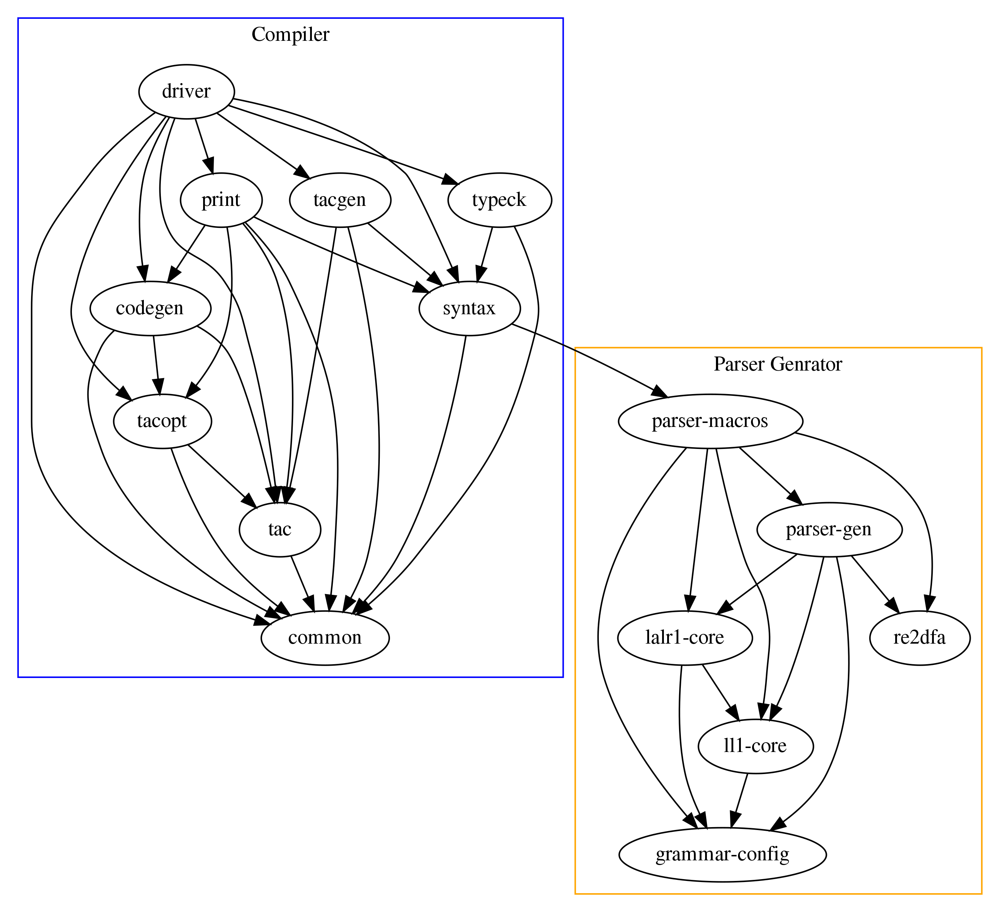

# Rust 框架分阶段实验指导

本书的这一部分介绍 Rust 框架各阶段实验的主要任务以及框架中一些重要的实现方法。

by MashPlant

## 实验概览

同其他版本的框架一样，本框架也需要经历以下几个阶段：

1. 词法分析/语法分析

  利用parser generator来实现lexer和parser的构造，包含以下两个部分：
    - pa1a 使用lalr(1)文法，配合终结符的优先级和结合性，很方便地构造parser
    - pa1b 使用ll(1)文法，很不方便地构造parser，还要求进行一定程度的错误恢复
  
  ~~孰难孰易，一目了然~~

2. 语义分析

  对ast进行类型检查，并将ast中的语法元素(如变量引用)以恰当的方式组织起来，方便后续中间代码生成。

5. 中间代码生成

  将ast翻译成中间代码，我们使用的中间代码为三地址码(tac, Three Address Code)。

4. 数据流分析

  在中间代码的层次上利用数据流分析进行一定程度的优化。

5. 目标代码生成

  实现编译器后端，将中间代码翻译成目标代码，我们选择的目标代码是mips。

关于decaf语言本身的规范，可以参考专门的文档，这里就不重复列举了。

## 组织结构

实验框架是一个模块化的系统，以rust的crate为分界，将编译器的各逻辑模块分隔开。除了软件工程方面的考虑外，这样做一个很大的好处在于减少了对单个模块的修改后的编译时间，这在一定程度上缓解了rustc相比于javac的编译时间的劣势。

完成所有pa之后，我们的编译器的组织结构如下，其中箭头表示依赖关系，`Compiler`部分是我们实现的编译器部分，`Parser Generator`部分是如何组织的其实我们的实验不用关心，这里只是单纯的列一下。

- common：提供一些通用的配置和工具
- syntax：提供ast各个节点的定义，也提供了类型的定义(也许放在这里不太合适，这样做是为了避免crate间循环引用)
- typeck：执行语义分析，类型检查
- tac：提供tac的定义和相关数据结构
- tacgen：将ast翻译为tac
- tacopt：将tac划分为流图，并执行一些基于数据流的优化
- codegen：实现编译器后端，目前实现了mips代码的生成
- print：提供各种结果或中间结果(如ast，tac，asm)的输出
- driver：将各个crate的内容整合起来，组成一个可执行文件并执行测试

得益于模块化的实验框架，这个编译器更像是一个编译器**库**而非一个不可分割的独立的可执行程序，因此实验结果的测试不需要依赖于python脚本之类的工具，直接在rust里执行就可以。

`driver` crate中包含测试相关的代码，最终实验结果的检查是在`test.rs`中，通过需要修改`Pa` enum的取值来确定具体执行哪个pa阶段的测试。我给测试结果的输出加上了颜色，不过经测试颜色的输出可能不太正常，如果遇到这样的情况，在测试前加上一行`color::control::set_override(false);`即可关闭测试结果的颜色效果。
