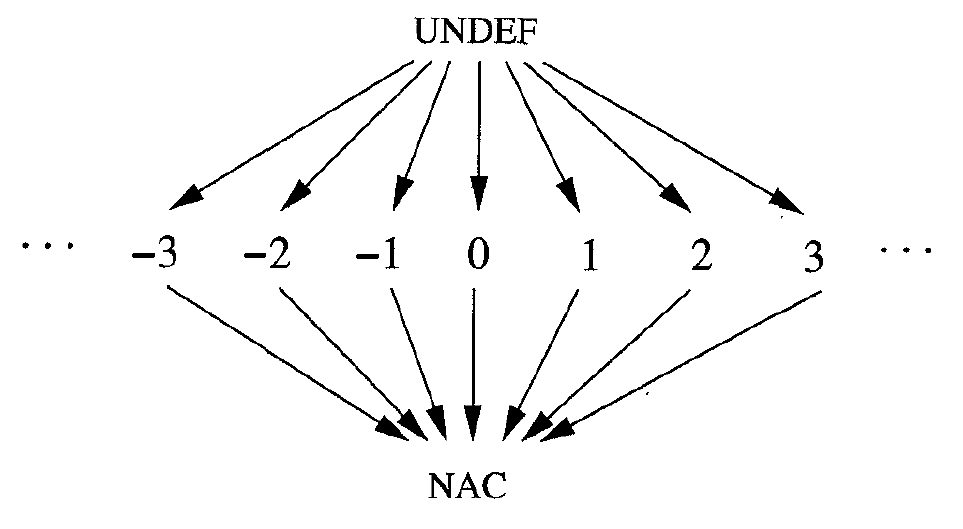

# 常量传播

## 原理

常量传播的目的在于发掘代码中可能存在的常量，尽量用对常量的引用替代对虚拟寄存器的引用(虚拟寄存器和变量是同一个概念，以下都使用变量)，并尽量计算出可以计算的常量表达式。

为了实现常量传播，类比于前两种数据流，不难想象常量传播的数据流是"可用常量分析"，找出在一条语句处有哪些对变量赋的常量值可以到达。每一条涉及到赋值的语句处，杀死之前与左端项相关的赋值，如果右端项为变量则生成对左端项的变量赋值；反之如果对左端项赋予了一个常量值或者常量表达式，则生成对左端项的常量赋值。

形式化地，常量传播的值集是$$R \rightarrow V$$的函数的集合。其中$$R$$是变量，$$V$$是集合$$变量的所有可能取值 \cup \{NAC, UNDEF\}$$，它用来表示变量在一个程序点处的取值。其中$$NAC$$表示已知它的值不是一个常量；$$UNDEF$$表示不知道它的取值，出现$$UNDEF$$是因为这个程序点处这个变量尚未赋值。

> 如果你觉得函数太抽象了，可以认为值集就是一个元素类型为$$V$$的数组，用变量的id为下标访问，实际上也是这么实现的。
> 
> 这个数据流和其他数据流有一个很大的区别：它的值集的大小是无限的。不过这并不影响数据流分析算法的收敛性，感兴趣的同学可以自己查阅相关的资料。

单条语句的传递函数$$f_S$$定义为：设$$m' = f_S(m)$$(注意$$m$$和$$m'$$都属于值集，所以它们都是函数)，对于语句$$S$$：

- 如果$$S$$没有给任何变量赋值，则$$m' = m$$
- 否则，设$$S$$对变量$$x$$赋值了(假设一条语句最多只能给一个变量赋值)，则$$m'(y) = m(y), \forall y \in R, y \ne x$$，此外：
  - 如果赋值的右端项是常数$$c$$，则$$m'(x) = c$$
  - 如果赋值的右端项是表达式$$y \oplus z$$($$\oplus$$是任意一个运算符，也不仅局限于两个运算数的情况，单目运算和复写语句都可以归于此类，规则是类似的)则：
    - 如果$$m(y)$$和$$m(z)$$都是常数，则$$m'(x) = m(y) \oplus m(z)$$
    - 如果$$m(y)$$和$$m(z)$$中有一个是$$NAC$$，则$$m'(x) = NAC$$
    - 否则，$$m'(x) = UNDEF$$
  - 否则，$$m'(x) = NAC$$，这里可能包括赋值的右端项是函数的返回值，是访存的结果之类的，在简单的优化器中都直接认为这些结果不是常数

当两个基本块交汇的时候，对于每个变量，需要考虑以下几种情况：

- 如果两个基本块末尾处它都是常量，且两个常量值相等，则交汇结果为这个常量
- 如果一个基本块末尾处它是常量，另一个基本块结尾处它是$$UNDEF$$，则交汇结果为**这个常量**
  - 一旦出现了这样的情形，可能意味着后续程序中有使用未赋初值就使用一个变量的行为，优化器可以依据"未赋初值的变量可以有任何取值"，认为这个取值就是另一个基本块的常量值，从而就回到了前一种情形
- 如果两个基本块末尾处它都是$$UNDEF$$，则交汇结果为$$UNDEF$$
- 否则，交汇结果为$$NAC$$

这个交汇操作用格图表示如下：



## 框架中的实现

数据流分析过程中，执行运算$$y \oplus z$$时会有一个corner case，即除/模0的情况。为了简单起见，这样的运算结果我们直接认为是0，这其实就是编译器对于未定义行为的一种处理策略。关于未定义行为，死代码消除一章也有对应的描述。

> 实际的编译器中，对于这样的情形往往会汇报一个警告。你可能会发现，有些情况下编译的优化等级开高了之后会产生一些新的警告。这也许就是编译器在高等级的优化下，进行各种数据流分析的时候发现了程序的漏洞。

完成了数据流分析之后，对于每一条语句，可以得到这条语句处所有变量的取值，把这条语句用到的所有值是常数的变量都换成对应的常数。此外，如果基本块结尾处的条件跳转的条件也是常数，就可以把这个条件跳转替换成无条件跳转，这可能导致一些原先认为可达的基本块变成不可达的，所以可以调用`simplify`函数来删除不可达的基本块。

框架中，初值为对除了传入参数之外的所有变量都赋值$$UNDEF$$，这表示目前还不知道任何关于它的信息；对于表示传入参数的变量赋值$$NAC$$，因为参数一定不是常数(我注意到很多相关资料中都没有提到这一点，但是这一点对于编写实际的优化程序来说是不能忽略的)。

简单起见，实验框架只实现了对整数的常量传播，而像字符串，虚表这些地址则没有实现，统一用$$UNDEF$$来表示。这也就意味着，假设出现这样的代码：

```
  if (b) a = VTBL<C>
  else a = 100
  // use a
```

根据上面描述的交汇规则，下面使用`a`的地方会认为`a`是常量`100`。出现这个结果的直接原因是这样的tac本来就不能算作合法，`VTBL<C>`和`100`本来就不应该以同样的方式被使用，既然是不合法的程序，优化后语义发生变化也是很正常的；更根本的原因是tac中没有类型信息，导致这样的不合法的tac看起来还挺合法的。

> 你可能觉得`VTBL<C>`是地址，地址和整数混用没有什么问题，然而这只是在机器码层面没有什么问题，任何设计良好的ir中，地址和整数一定是不能混用的，它们之间的相互转换一定是有对应的指令的，哪怕这条指令最终并不生成任何机器码，在分析过程中它也是必要的。